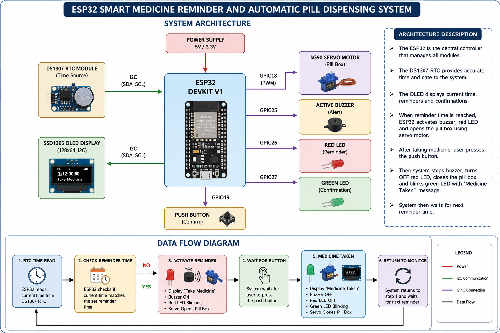

# 💊 ESP32 Smart Medicine Reminder and Automatic Pill Dispensing System

## 📌 Project Overview

The **ESP32 Smart Medicine Reminder and Automatic Pill Dispensing System** is an IoT-based healthcare project developed to help patients take their medications on time. The system uses an ESP32 microcontroller and a DS1307 Real-Time Clock (RTC) module to monitor the current time and trigger medicine reminders automatically.

At the scheduled time, the OLED display shows a reminder message, the buzzer sounds, the red LED blinks, and the servo motor opens the medicine compartment. After taking the medicine, the user presses the push button to confirm, upon which the buzzer stops, the servo closes the compartment, the OLED displays **"Medicine Taken"**, and the green LED blinks to indicate successful confirmation.

---

# 🎯 Objectives

- Provide timely medicine reminders.
- Reduce the chances of missing medications.
- Automate medicine dispensing using a servo motor.
- Display reminder messages on an OLED display.
- Provide audible and visual alerts.
- Allow the user to confirm medicine intake.

---

# ✨ Features

- ⏰ Real-Time Clock (RTC) based reminders
- 📺 OLED Display for notifications
- 💊 Automatic pill dispensing using Servo Motor
- 🔴 Red LED reminder indication
- 🟢 Green LED confirmation indication
- 🔔 Active Buzzer alert
- 🔘 Push Button confirmation
- ⚡ ESP32-based embedded system
- 🌐 Wokwi simulation support

---

# 🛠 Components Required

- ESP32 DevKit V1
- DS1307 RTC Module
- SSD1306 OLED Display (128×64, I2C)
- SG90 Micro Servo Motor
- Push Button Switch
- Active Buzzer
- Red LED
- Green LED
- 220Ω Resistors (2)
- Jumper Wires
- Breadboard

---

# 🔌 Circuit Connections

| Component | ESP32 Pin |
|------------|-----------|
| RTC SDA | GPIO21 |
| RTC SCL | GPIO22 |
| OLED SDA | GPIO21 |
| OLED SCL | GPIO22 |
| Servo PWM | GPIO18 |
| Buzzer | GPIO25 |
| Red LED | GPIO26 |
| Green LED | GPIO27 |
| Push Button | GPIO19 |
| RTC VCC | 5V |
| OLED VCC | 3.3V |
| Servo VCC | 5V |
| Common Ground | GND |

---

# 📂 Project Files

| File | Description |
|------|-------------|
| ESP32_Smart_Medicine_Reminder.ino | Main Arduino source code |
| diagram.json | Wokwi simulation circuit |
| Circuit_Design.png | Circuit diagram image |
| Schematic_Diagram.pdf | Schematic wiring diagram |
| Components_list.csv | Hardware components list |
| Take_medicine.png | Reminder output screenshot |
| Medicine_taken.png | Confirmation output screenshot |
| README.md | Project documentation |

---

# ⚙ Software Requirements

- Arduino IDE
- Wokwi Simulator
- ESP32 Board Package

## Required Libraries

- Wire.h
- RTClib
- Adafruit_GFX
- Adafruit_SSD1306
- ESP32Servo

---

# 🚀 Working Procedure

1. ESP32 continuously reads the current time from the DS1307 RTC module.
2. The OLED displays the current system time.
3. At the reminder time:
   - Servo motor opens the medicine compartment.
   - Red LED starts blinking.
   - Buzzer starts beeping.
   - OLED displays **"Take Medicine"**.
4. The user presses the push button after taking the medicine.
5. The system:
   - Stops the buzzer.
   - Turns OFF the red LED.
   - Closes the servo motor.
   - Displays **"Medicine Taken"** on the OLED.
   - Blinks the green LED for confirmation.
6. The system returns to standby mode and waits for the next reminder.

---

# 📷 Project Output

## 🖥 Circuit Design

The figure below shows the complete circuit implemented in the Wokwi simulator.


---

# 🏗 System Architecture

The following diagram illustrates the overall architecture of the ESP32 Smart Medicine Reminder and Automatic Pill Dispensing System. The ESP32 acts as the central controller and communicates with all peripherals, including the RTC module, OLED display, servo motor, buzzer, LEDs, and push button.

The DS1307 RTC continuously provides the current time to the ESP32 through the I²C interface. When the scheduled reminder time is reached, the ESP32 activates the buzzer, blinks the red LED, displays a reminder on the OLED screen, and opens the medicine compartment using the servo motor. After the user presses the push button to confirm medicine intake, the ESP32 stops the reminder, closes the compartment, blinks the green LED, and displays a confirmation message.



---

## 📄 Components List

The Components List contains all the hardware components required to build this project.

**Download:**  
📄 [Components_list.csv](Components_list.csv)

---

## 🔧 Wokwi Circuit Design

The `diagram.json` file contains the complete Wokwi simulation circuit. It can be imported directly into Wokwi for simulation and testing.

**Download:**  
📄 [diagram.json](diagram.json)

---

## 📑 Circuit Schematic

The schematic diagram illustrates the complete wiring connections between the ESP32, RTC module, OLED display, LEDs, servo motor, buzzer, and push button.

**Download:**  
📄 [Schematic_Diagram.pdf](Schematic_Diagram.pdf)

---

## 💻 Arduino Source Code

The Arduino sketch contains the complete implementation of the Smart Medicine Reminder System.

**Download:**  
📄 [ESP32_Smart_Medicine_Reminder.ino](ESP32_Smart_Medicine_Reminder.ino)

---

## 💊 Medicine Reminder Output

When the reminder time is reached, the OLED displays **"Take Medicine"**, the red LED blinks, the buzzer sounds, and the servo opens the medicine compartment.


---

## ✅ Medicine Confirmation Output

After pressing the push button, the OLED displays **"Medicine Taken"**, the servo closes, the buzzer stops, and the green LED blinks for confirmation.


---

# 📁 Repository Structure

```
ESP32-Smart-Medicine-Reminder/
│
├── README.md
├── ESP32_Smart_Medicine_Reminder.ino
├── diagram.json
├── Circuit_Design.png
├── Schematic_Diagram.pdf
├── Components_list.csv
├── Take_medicine.png
└── Medicine_taken.png
```

---

# 📈 Future Enhancements

- 📱 Mobile Application Integration
- ☁ Cloud Data Logging
- 📶 Wi-Fi Notifications
- 📩 SMS Alerts using GSM
- 💊 Multiple Medicine Scheduling
- 🎤 Voice Reminder System
- 📊 Medicine Intake History
- 👨‍⚕ Patient Health Monitoring Integration

---

# 👨‍💻 Developed By

**Shriram Prasanna K**

B.Tech – Electronics and Communication Engineering (ECE)

VIT-AP University

---

# 📄 License

This project is developed for educational and learning purposes. Feel free to use, modify, and enhance it for academic or personal projects.
