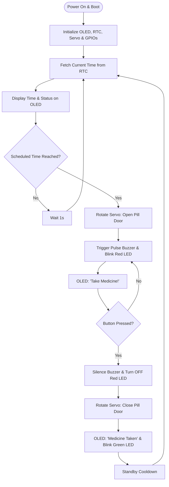
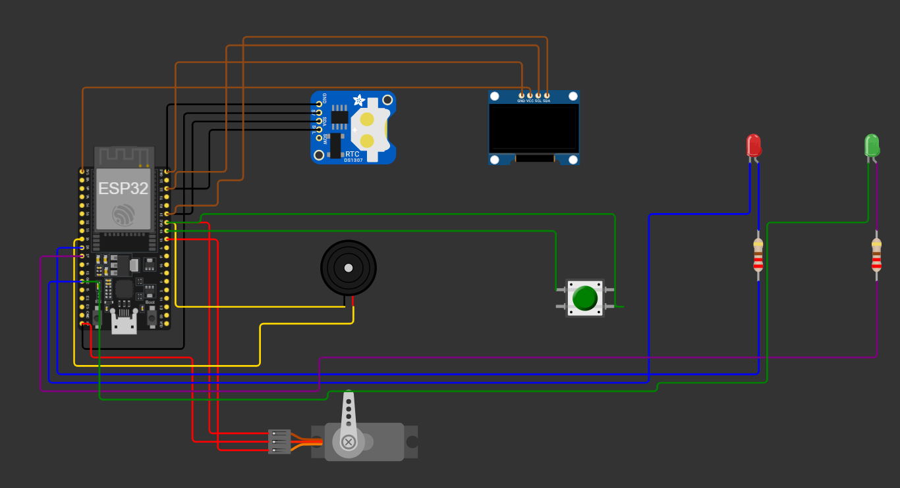
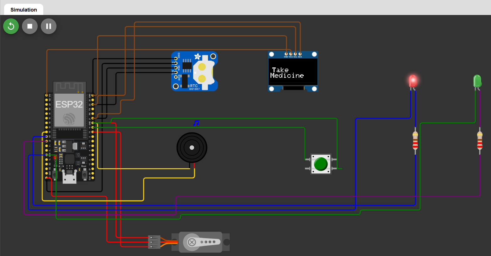
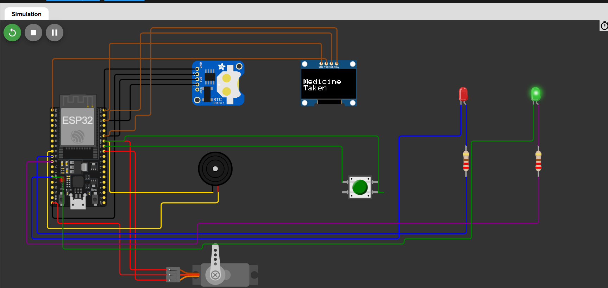

# 💊 ESP32 Smart Medicine Reminder & Automatic Pill Dispenser

> **An Intelligent, IoT-Enabled Healthcare Assistant**
> 
> *A low-latency embedded system that automates pill schedules, alerts patients using multi-sensory feedback, and tracks medication intake with physical user confirmation.*

---

## 🎯 Key Objectives

*   **Improve Adherence:** Eliminate human forgetfulness by automating medication reminders.
*   **Automated Dispensing:** Utilize a micro servo motor to open physical compartment doors exactly when scheduled.
*   **Active Alarms:** Grab attention immediately using coordinated auditory (buzzer) and visual (blinking LED) alerts.
*   **Double-Check Intake:** Log intake verification using a physical push button to ensure the patient has actively responded.

---

## ✨ Features & Modules

*   **⏰ Precision Real-Time Scheduling:** Keeps track of hours, minutes, and seconds using a high-precision hardware Real-Time Clock (RTC) module.
*   **💊 Mechanical Compartment Control:** Uses a micro servo motor to rotate and reveal the scheduled pills.
*   **📺 Real-Time OLED Readout:** Features a crisp, high-contrast monochrome screen for current time status and custom instructions.
*   **🚨 Multi-Sensory Alert System:** Co-orchestrates a pulsing active buzzer and flash-strobe Red LED warning.
*   **🔘 Patient Intake Confirmation:** Prevents accidental alarms or false logs by expecting a physical button press before closure.
*   **🟢 Success Acknowledgment:** Blinks a high-visibility Green LED and updates the display once medicine is taken.

---

## 🏗️ System Architecture & Logic Flow

The ESP32 processes current time inputs from the DS1307 RTC and matches them against pre-set schedules. It manages displays, initiates servo movement, triggers alarms, and listens for the patient's tactile button response.

### Functional Flowchart

---

## 🔌 Hardware Configuration & Pin Mappings

Both the OLED screen and the RTC module share the ESP32’s primary hardware I²C interface (`GPIO21` and `GPIO22`). 

### Pin Interface Table

| Hardware Module | Module Pin | ESP32 GPIO | Connection Type | Description / Role |
| :--- | :--- | :---: | :---: | :--- |
| **DS1307 RTC** | SDA | `GPIO 21` | I²C Data | Transmits current date/time data |
| **DS1307 RTC** | SCL | `GPIO 22` | I²C Clock | Synchs clock transmission rate |
| **SSD1306 OLED** | SDA | `GPIO 21` | I²C Data | Transmits text/graphics drawings |
| **SSD1306 OLED** | SCL | `GPIO 22` | I²C Clock | Synchs screen drawing commands |
| **SG90 Servo** | PWM Signal | `GPIO 18` | Output (PWM) | Directs compartment rotation angle |
| **Active Buzzer** | Positive Terminal | `GPIO 25` | Output (Digital) | Drives audio warning alarm |
| **Red Indicator LED** | Anode | `GPIO 26` | Output (Digital) | Active blinking warning light |
| **Green Indicator LED**| Anode | `GPIO 27` | Output (Digital) | Success intake confirmation light |
| **Push Button** | Terminal | `GPIO 19` | Input (Pull-Up) | Registers user intake confirmation |
| **DS1307 RTC** | VCC | `5V` | Power | Input voltage line |
| **SSD1306 OLED** | VCC | `3.3V` | Power | Input voltage line |
| **SG90 Servo** | VCC | `5V` | Power | Input voltage line |
| **Common GND** | GND | `GND` | Ground | Shared reference ground link |

---

## ⚙️ Working Sequence

1.  **Standby Status:** The ESP32 displays the current time on the SSD1306 OLED screen while checking the RTC logs.
2.  **Alert Initialization:** When the current clock matches the designated medication slot:
    *   The **Servo Motor** rotates to reveal the correct pill chamber.
    *   The **Red LED** flashes and the **Buzzer** makes a rhythmic buzzing sound.
    *   The screen updates to display a high-contrast **"Take Medicine!"** notice.
3.  **Patient Action:** The patient takes the medication and presses the tactile **Confirmation Button**.
4.  **Dispenser Closure:**
    *   The **Buzzer** turns silent and the **Red LED** turns off.
    *   The **Servo Motor** returns to its initial position, locking the chamber.
    *   The **Green LED** blinks three times and the OLED shows **"Medicine Taken"**.
5.  **Return to Standby:** The system enters standby mode and waits for the next alarms.

---

## 📷 Project Gallery

### Circuit Design

### Medicine Reminder Display

### Intake Confirmation Display

---

## 📂 Project Repository Files

| File Name | File Type | Description |
| :--- | :---: | :--- |
| `ESP32_Smart_Medicine_Reminder.ino` | Firmware | Main Arduino IDE source file with system routines |
| `diagram.json` | JSON | Configuration details for the Wokwi emulator |
| `Circuit_Design.png` | Image | Schematic wiring schematic layout image |
| `System_Architecture.png` | Image | Functional block architecture diagram |
| `Schematic_Diagram.pdf` | Document | Portable document format schematic diagram |
| `Components_list.csv` | CSV | Bill of Materials (BOM) for ordering hardware |
| `Take_medicine.png` | Image | OLED active reminder state screen capture |
| `Medicine_taken.png` | Image | OLED confirmation state screen capture |
| `README.md` | Document | Detailed system handbook and installation guide |

---

## 💻 Software Prerequisites & Libraries

The system code runs on **C++** using the **Arduino Core for ESP32**. Ensure the following libraries are installed prior to compilation:

*   `Wire.h` (Built-in I²C driver)
*   `RTClib` (by Adafruit)
*   `Adafruit_SSD1306` (by Adafruit)
*   `Adafruit_GFX` (by Adafruit)
*   `ESP32Servo` (by Kevin Harrington)

---

## 🚀 Future Roadmap

*   [ ] **Mobile Application Interface:** Create a custom smartphone app to manage schedules remotely.
*   [ ] **Wireless Alerts:** Send email or push notifications over Wi-Fi using the ESP32 network adapter.
*   [ ] **Firebase Cloud Logging:** Connect to a real-time database to track dosing history and miss logs.
*   [ ] **Caregiver SMS Alerts:** Forward automated texts to healthcare providers or relatives via Twilio APIs.
*   [ ] **Voice Assistance:** Integrate an external MP3 decoder board to speak custom instructions to users.
*   [ ] **Multi-Dose Layouts:** Support several separate compartments for multiple users or times of day.

---

## 📊 Project Status

*   **Hardware Design:** ✅ Completed
*   **Embedded Programming:** ✅ Completed
*   **Wokwi Simulation:** ✅ Completed
*   **Documentation:** ✅ Completed
*   **KiCad PCB Design:** 🚧 In Progress
*   **Cloud Integration:** 🔜 Planned

---

## ⚠ Disclaimer

This system is developed strictly for **educational and research purposes**. It is not certified or approved for clinical diagnostic use, critical therapy administration, or commercial medication tracking. Do not rely on it for actual medical treatment without verification from certified systems.

---

## 👨‍💻 Author

**Shriram Prasanna K**
*   Bachelor of Technology (B.Tech)
*   Electronics and Communication Engineering (ECE)
*   VIT-AP University

---

## 📄 License

This repository is distributed for **educational and learning purposes**. You are free to fork, modify, improve, and share this project with appropriate credit given to the original author.
